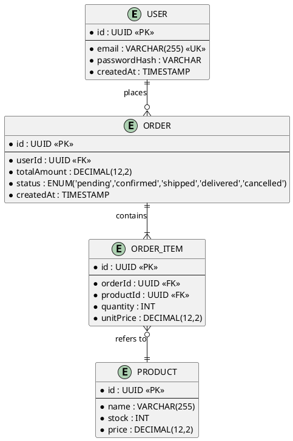
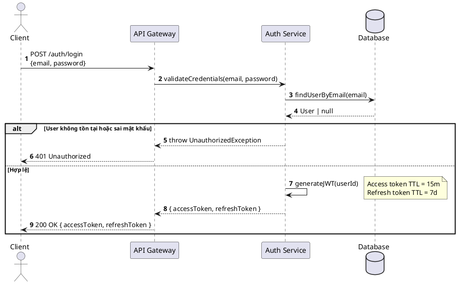
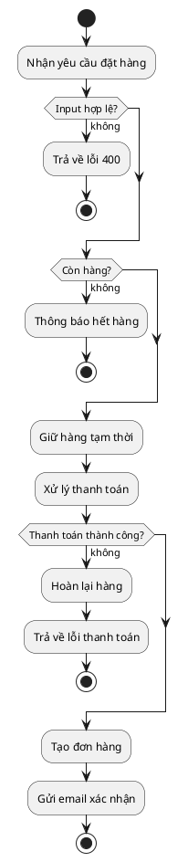
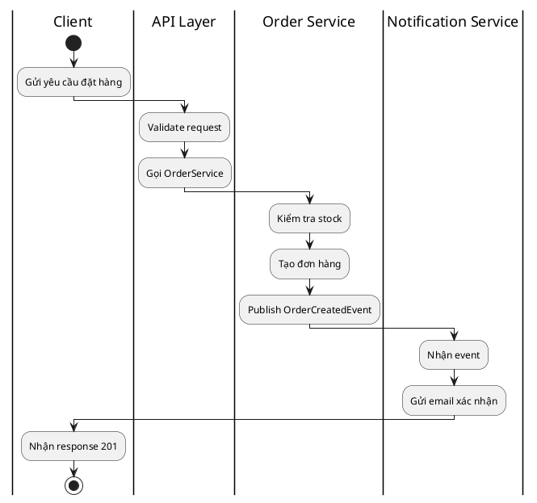
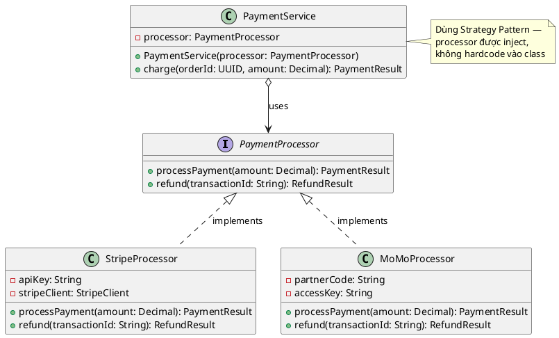
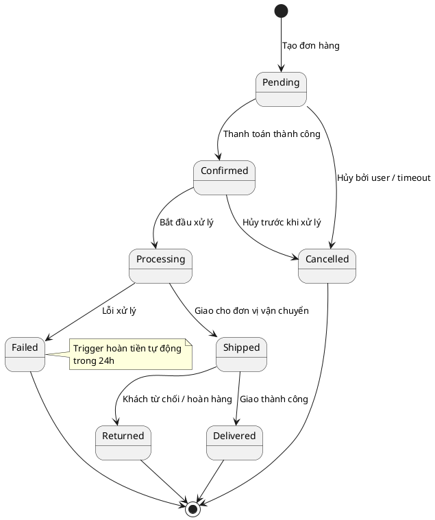
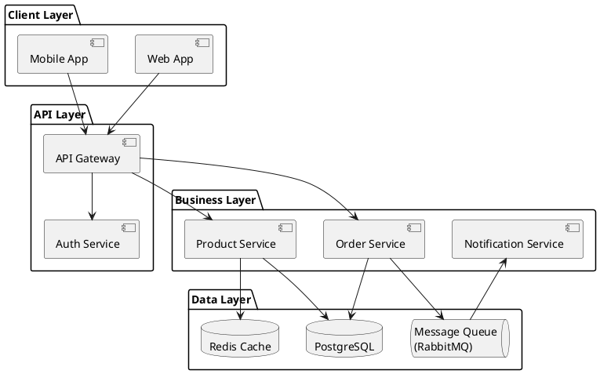

# SKILL-diagram.md — Vẽ Sơ đồ Kỹ thuật

Skill này định nghĩa **loại sơ đồ nào dùng khi nào**, **tool nào render**, và **cú pháp chuẩn**.  
Agent đọc file này khi nhận lệnh vẽ diagram hoặc khi Bước 2 trong AGENTS.md yêu cầu.

---

## 1. Chọn loại sơ đồ

| Tình huống | Loại sơ đồ | Tool |
|---|---|---|
| Mô tả cấu trúc bảng / collection và quan hệ | **ERD** | PlantUML |
| Mô tả luồng request qua các service / layer | **Sequence Diagram** | PlantUML |
| Mô tả cấu trúc class, kế thừa, interface | **Class Diagram** | PlantUML |
| Mô tả luồng xử lý, điều kiện, vòng lặp | **Activity Diagram** | PlantUML |
| Mô tả các service, component và kết nối tổng thể | **Component / C4** | PlantUML |
| Mô tả trạng thái và sự chuyển đổi | **State Diagram** | PlantUML |
| Sơ đồ đơn giản, nhúng nhanh vào Markdown/GitHub | Bất kỳ | Mermaid (fallback) |

**Nguyên tắc chọn:**
- Dùng **PlantUML** làm mặc định — cú pháp biểu đạt hơn, hỗ trợ C4, grouping, styling đầy đủ.
- Dùng **Mermaid** khi môi trường không render được PlantUML (GitHub README thuần, Notion, tool chỉ hỗ trợ Mermaid).
- Mỗi sơ đồ chỉ nên truyền tải **một thông điệp chính** — nếu quá phức tạp, tách thành 2 sơ đồ.

---

## 2. Cú pháp PlantUML — Từng loại

> Bọc code trong fenced block với ngôn ngữ `plantuml`:
> ````
> ```plantuml
> @startuml
> ...
> @enduml
> ```
> ````

---

### 2.1 ERD (Entity Relationship Diagram)

Dùng cho: data model, database schema.



**Ký hiệu quan hệ PlantUML:**
| Ký hiệu | Nghĩa |
|---|---|
| `\|\|--\|\|` | Một - Một (bắt buộc cả hai) |
| `\|\|--o\|` | Một - Một (một bên tùy chọn) |
| `\|\|--o{` | Một - Nhiều (nhiều bên tùy chọn) |
| `\|\|--\|{` | Một - Nhiều (nhiều bên bắt buộc) |
| `}o--o{` | Nhiều - Nhiều |

---

### 2.2 Sequence Diagram

Dùng cho: luồng API, luồng xác thực, tương tác giữa services.



**Quy tắc:**
- Luôn bật `autonumber` để dễ tham chiếu khi review.
- Dùng `actor` cho người dùng/client bên ngoài.
- Dùng `participant`, `database`, `boundary`, `control`, `entity` để phân biệt loại thành phần.
- `-->` cho response (đường nét đứt), `->` cho request (đường liền).
- `alt` / `else` / `opt` / `loop` để mô tả phân nhánh và lặp.
- `note right/left/over` để giải thích điều không hiển nhiên.

---

### 2.3 Activity Diagram (Flowchart)

Dùng cho: luồng xử lý nghiệp vụ, decision tree, thuật toán.



**Ký hiệu:**
| Cú pháp | Ý nghĩa |
|---|---|
| `:Tên;` | Hành động / bước xử lý |
| `if (...) then (nhánh)` | Điều kiện phân nhánh |
| `fork` / `fork again` / `end fork` | Xử lý song song |
| `repeat` / `repeat while` | Vòng lặp |
| `group Tên` | Nhóm các bước liên quan |
| `\|Swimlane\|` | Phân làn theo actor/service |

**Ví dụ swimlane** (phân rõ ai làm gì):



---

### 2.4 Class Diagram

Dùng cho: cấu trúc OOP, kế thừa, interface, design pattern.



**Ký hiệu quan hệ:**
| Ký hiệu | Nghĩa |
|---|---|
| `<\|--` | Kế thừa (inheritance) |
| `<\|..` | Implement interface (realization) |
| `-->` | Dependency (dùng, không sở hữu) |
| `*-->` | Composition (sở hữu, cùng vòng đời) |
| `o-->` | Aggregation (chứa, khác vòng đời) |

**Visibility:** `+` public, `-` private, `#` protected, `~` package

---

### 2.5 State Diagram

Dùng cho: vòng đời của entity (đơn hàng, ticket, user account...).



---

### 2.6 Component / C4 Diagram

Dùng cho: kiến trúc tổng thể hệ thống, microservices, C4 model.



---

## 3. Quy tắc trình bày

### Đặt tiêu đề
Luôn đặt tiêu đề rõ ràng ngay sau `@startuml`:
```
@startuml Sequence - User Login Flow
```
Format: `[Loại diagram] - [Tên chức năng / luồng]`

### Đặt tên
- Tên ngắn gọn, đủ nghĩa — tối đa 5-6 từ.
- Không viết tắt khó hiểu (`Auth` thay vì `A`, `DB` thay vì `D`).

### Nhóm & phân tầng
- Sequence Diagram: sắp xếp participant từ trái sang phải theo hướng luồng dữ liệu.
- Class Diagram: dùng `package` để nhóm các class cùng layer/domain.
- Component Diagram: dùng `package` hoặc `node` để phân tầng kiến trúc.

### Ghi chú
Dùng `note` để giải thích quyết định thiết kế hoặc constraint không hiển nhiên — **không** giải thích điều đã rõ từ tên:
```
note right of AuthService : JWT TTL = 15 phút, lý do xem ADR-003
note over DB : Index trên (email, status) — query chính của dashboard
```

---

## 4. Fallback — Khi dùng Mermaid

Chỉ dùng Mermaid khi môi trường **không render được PlantUML** (GitHub README, Notion, Linear...).

| PlantUML | Mermaid tương đương |
|---|---|
| Sequence Diagram | `sequenceDiagram` |
| Activity / Flowchart | `flowchart TD` |
| Class Diagram | `classDiagram` |
| State Diagram | `stateDiagram-v2` |
| ERD | `erDiagram` |

Khi dùng Mermaid, vẫn áp dụng đầy đủ quy tắc đặt tên, nhóm, và ghi chú ở Mục 3.

---

## 5. Checklist trước khi xuất diagram

- [ ] Diagram có tiêu đề theo format `[Loại] - [Tên]` không?
- [ ] Mỗi node/participant có tên tự giải thích không?
- [ ] Các phân nhánh đã bao gồm cả happy path và error path chưa?
- [ ] Diagram có quá 15 node không? → Nếu có, hãy tách thành 2 diagram.
- [ ] Quan hệ trong ERD có đúng cardinality không?
- [ ] Trong Class Diagram, đã thể hiện dependency injection chưa?
- [ ] Có `note` giải thích các quyết định thiết kế không hiển nhiên chưa?
